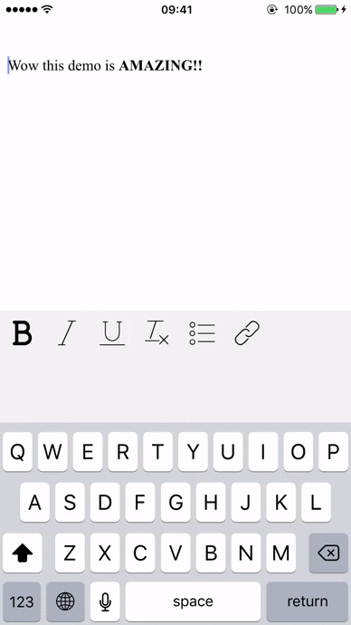

# react-native-richtext-editor
A Flexible Rich Text Editor for React Native

**This library currently supports only iOS**

### Demo


### Installation
- Still not on npm. In the meantime, add this dependency on your package.json file:

```"react-native-richtext-editor": "HoneyBook/react-native-richtext-editor"```

- Then, in order to add both the editor and its toolbar separately, add these requires to your code:
```
var HBRichTextEditor = require('react-native-richtext-editor');
var HBToolbar = require('react-native-richtext-editor/HBToolbar');
```

- In your render method, add the components like this:
```
<HBRichTextEditor
                ref="myWebView"
                initialHTML={bodyForDisplay}/>
<HBToolbar />
```

### Props Configuration
- **toolbarItems** : the Toolbar items array. **MUST** contain only HBToolbarItem object instances. Also, they must identify themselves (key + type) according to the list of pre-defined constants listed in HBEditorConstants.

### Events emitted from the editor
- **HBEditorConstants.HB_RICH_EDITOR_GOT_FOCUS** : Will fire when the editor gets focus
- **HBEditorConstants.HB_RICH_EDITOR_TOOLBAR_BUTTON_WAS_PRESSED** : Will fire every time a toolbar button has been pressed. As a payload you'll get "pressedButton" - the specific HBToolbarItem that was pressed.

### TODOs
- Android Support

License
----
BSD 3-Clauses
